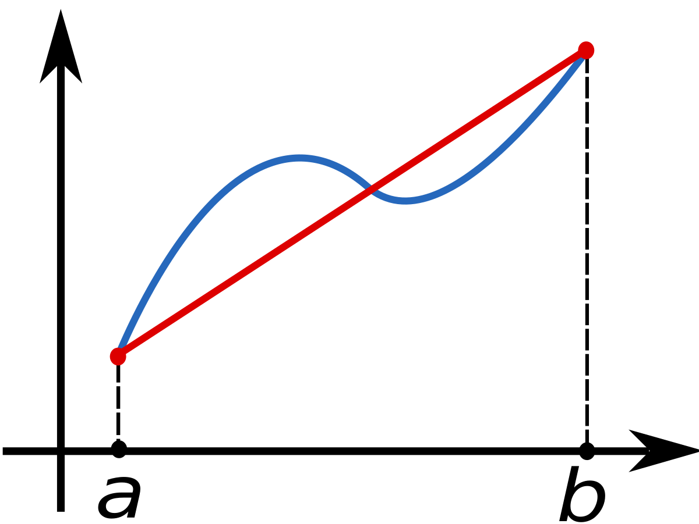

# Integrasi numerik
## Apa itu integrasi numerik
Integrasi numerik adalah suatu teknik menghitung nilai numerik dari integral tertentu.

$$
I = \int ^{b}_{a} f(x)dx
$$

integrasi numerik berguna saat fungsi yang diintegralkan secara analitis berhujung pada titik buntu dan atau hasil yang diperoleh tidaklah analitis namun hanya sebuah titik-titik data

## Metode trapezoid
Merupakan sebuah cara dalam mendekati integral dengan metode poloinom rde satu Kurva yang terbentuk dengan metode ini akan tampak seperti trapesium dikarenakan kurva yang akan disesuaikan dengan garis lurus



area yang ada dibawah kurva memiliki luas yang digambakan dengan fungsi $f(x)$ yang mana akan membentuk trapesium antara $a=x_{0}$ dan $b=x_{1}$. Sisi atas dan alas dalam trapesium diwakilkan oleh $f(a)$ dan $f(b)$ dan $b-a$ sebagai tingginya.

masukkan kedalam rumus trapesium:

$$
L=\dfrac{1}{2} \times (b_{1} + b_{2}) \times t
$$

$$
L=\dfrac{1}{2} \times [f(x_{0} + f(x_{1})] \times (x_{1} - x_{0})
$$

sehingga

$$
\int ^{b}_{a} f(x) \approx \dfrac{1}{2} \times h \times [f(x_{0}) + f(x_{1})] = T_{1}(f)
$$

dengan

$$
h = (x_{1} - x_{0})
$$

itu baru satu partisi, bagaimana kalau seandainya memiliki banyak partisi (trapesium)? maka...

$$
L_{i} = \dfrac{1}{2} \times (f(x_{i}) + f(x_{i+1})) \times \Delta x_{i}
$$

atau

$$
L_{i} = \dfrac{1}{2} \times (f_{i} + f_{i+1}) \times \Delta x_{i}
$$

dan total dari seluruh luas trapesium....

$$
L = \sum ^{n-1}_{i=0} L_{i}
$$

sehingga...

$$
L = \sum ^{n-1}_{i=0} L_{i} \dfrac{1}{2} \times (f_{i} + f_{i+1}) = \dfrac{h}{2} \times (f_{0} + 2f_{1} + ... + 2f_{n-1} + 2f_{n})
$$

## Algoritma

### Batas bawah dan partisi
hal pertama yang harus dilakukan adalah untuk menerima input batas bawah dan batas atas, begitu juga dengan pembagi (partisi)
```python
bb = float(input("Masukkan batas bawah: "))
ba = float(input("Masukkan batas atas: "))
dvder = float(input("Tentukan jumlah pembagi: "))
```

lalu buat variable tinggi (h) dengan cara membagi batas atas yang sebelmunya dikurangi oleh batas bawah

```python
h = float((ba-bb)/dvder)
x = bb
```

### Membuat fungsi

```python
def fx(x):
    return float(2*x*x*x)
def fx_exact(y):
    return float((y*y*y*y)/2)
```

### Tentukan luas
menentukan $l_{0}$ dan $l_{1}$ dan juga nilai x yang didapat dari batas bawah ditambah dengan tinggi, tidak lupa untuk membuat variable bernialai 0 sebagai penampung hasil

```python
x = bb+h
res_luas = 0
l0 = fx(bb)
l1 = fx(ba)
```

## Source Code
```python
def fx(x):
    return float(2*x*x*x)
def fx_exact(y):
    return float((y*y*y*y)/2)

bb = float(input("Masukkan batas bawah: "))
ba = float(input("Masukkan batas atas: "))
dvder = float(input("Tentukan jumlah pembagi: "))

h = float((ba-bb)/dvder)
x = bb

print("x\t\tf(x)")

while(x<(ba+h)):
    print("{}\t{}".format(x, fx(x)))
    x += h

x = bb+h
res_luas = 0
l0 = fx(bb)
l1 = fx(ba)

while(x<ba):
    l2 = fx(x)
    res_luas += l2
    x += h

trape = (h*(l0+l1+(2*res_luas)))/2
res_exact = fx_exact(ba) - fx_exact(bb)
error = float(trape-res_exact)

print("Hasil Integral Eksak = {}".format(res_exact))
print("Hasil Integral Trapezoid = {}".format(trape))
print("Error = {}".format(error))
```

## Hasil

```
Masukkan batas bawah: 0
Masukkan batas atas: 1
Tentukan jumlah pembagi: 10
x                       f(x)
0.0                     0.0
0.1                     0.0020000000000000005
0.2                     0.016000000000000004
0.30000000000000004     0.05400000000000002
0.4                     0.12800000000000003
0.5                     0.25
0.6                     0.432
0.7                     0.6859999999999998
0.7999999999999999      1.0239999999999998
0.8999999999999999      1.4579999999999995
0.9999999999999999      1.9999999999999993
1.0999999999999999      2.661999999999999
Hasil Integral Eksak        = 0.5
Hasil Integral Trapezoid    = 0.7049999999999998
Error                       = 0.20499999999999985
```